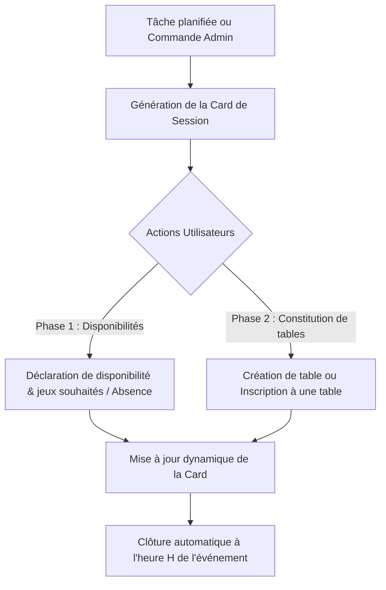

# Spécifications Métier & Règles de Gestion — CTR-Roster

## 1. Contexte & Objectifs

**CTR-Roster** est un bot Discord conçu pour le club de jeu **CTR** (regroupant wargames, jeux de société, jeux de rôle, TCG). 

### Objectif principal
Centraliser et structurer l'organisation asynchrone des soirées jeux hebdomadaires (ex. vendredi soir / week-end). Le bot élimine les discussions éparpillées en fournissant un **point d'ancrage visuel unique** : un message récapitulatif interactif et dynamique (Embed / Card Discord) mis à jour en temps réel.

---

## 2. Personas & Droits

### 2.1. Administrateur (`Admin`)
Détenteur d'un rôle Discord dédié (configuré via `Discord:AdminRoleId`).
- Configure le salon de publication automatique du bot (`/admin-config-channel`).
- Configure la planification récurrente (`/admin-config-schedule` avec expression cron).
- Gère le catalogue de jeux de l'association (`/admin-game-add`, `/admin-game-list` pour activer/désactiver).
- Déclenche manuellement une session à la demande (`/admin-session-create`).
- Dispose du droit de modération et de dissolution manuelle sur n'importe quelle table.
- Hérite de toutes les fonctionnalités d'un utilisateur standard.

### 2.2. Utilisateur standard (`User`)
Tout membre du serveur Discord participant aux soirées jeux.
- Déclare sa disponibilité et ses préférences de jeu (un ou plusieurs jeux du catalogue, ou saisie libre « Autre »).
- Se déclare absent (ce qui libère toute assignation de table et met à jour son statut).
- Crée une nouvelle table de jeu (choix du jeu, rôle, assignation directe optionnelle d'autres membres).
- Rejoint une table existante en tant que **Joueur** ou **Observateur / Spectateur**.
- Quitte sa table actuelle pour revenir dans le pool des joueurs disponibles.

---

## 3. Déroulement d'une Session de Jeu

L'organisation d'une session s'articule en deux phases complémentaires au sein d'une même Card Discord :



### Phase 1 : Déclaration des disponibilités
- Les membres indiquent s'ils sont disponibles ou absents.
- En cas de disponibilité, ils sélectionnent un ou plusieurs jeux du catalogue, avec la possibilité d'ajouter un jeu hors-catalogue via un champ libre (« Autre »).
- Ces joueurs apparaissent dans la section **DISPONIBILITÉS (Non assignés)** de l'Embed.

### Phase 2 : Constitution des tables de jeu
- Les joueurs s'organisent pour former des tables physiques (ex: Table Warhammer 40k en 1v1, Table Catan 4 joueurs, etc.).
- La création d'une table spécifie le jeu et les participants initiaux.
- Des participants supplémentaires peuvent rejoindre une table existante tant que la capacité le permet ou pour observer.
- Tout joueur peut créer une table en renseignant directement des participants sans qu'ils soient préalablement déclarés disponibles (composition directe).

---

## 4. Règles Métier & Invariants Critiques

Ces règles doivent être strictement validées dans la couche Domaine / Application :

| Règle | Description & Comportement |
| :--- | :--- |
| **Exclusivité joueur** | Un utilisateur Discord ne peut appartenir qu'à **une seule table active** par session (que ce soit comme joueur ou observateur). |
| **Seuil critique de table** | Une table requiert un minimum de **2 joueurs**. Si un désistement fait descendre l'effectif des joueurs à **1**, la table est **automatiquement dissoute** et les membres restants sont reversés dans le statut disponible. |
| **Gouvernance de table** | Seul le **créateur initial de la table** ou un **Admin** peut dissoudre manuellement une table. Un membre ordinaire peut uniquement se retirer lui-même. |
| **Consentement d'assignation directe** | Lorsqu'un joueur assigne directement un autre membre à sa table, le bot envoie une notification mentionnant l'utilisateur assigné avec un bouton d'action immédiate pour refuser/quitter (`table:leave:{tableId}`). |
| **Statut Observateur** | L'observateur est physiquement rattaché à une table pour la soirée. Il compte dans l'exclusivité (ne peut observer ou jouer sur une autre table simultanément). |
| **Option d'échappement « Autre »** | La sélection de jeu propose toujours une option « Autre » ouvrant une modale avec champ texte libre afin de ne jamais bloquer l'organisation. |
| **Cycle de vie de la session** | Une session a un statut explicite (`Open`, `Locked`, `Closed`). Si une nouvelle session s'ouvre, la précédente est automatiquement clôturée (`Closed`). |

---

## 5. Rendu Visuel de la Card (Embed Discord)

La Card est le cœur de l'interaction utilisateur. Elle combine un Embed mis à jour de manière asynchrone et un jeu de composants Discord interactifs (Boutons, Menus déroulants).

```
╔══════════════════════════════════════════════════════════════╗
║ 🎲 SESSION DE JEU DU VENDREDI 18 SEPTEMBRE 2026              ║
║ Statut : 🟢 Inscriptions ouvertes                            ║
╠══════════════════════════════════════════════════════════════╣
║ 📋 DISPONIBILITÉS (Non assignés)                             ║
║ • @Alex : SdA, Warhammer 40k                                 ║
║ • @Bastien : Warhammer 40k, Autre (Dune)                     ║
║ • @Chloe : Catan, 7 Wonders                                  ║
║                                                              ║
║ ⚔️ TABLES FORMÉES                                            ║
║ ┌ Table 1 : Warhammer 40k (1v1)                              ║
║ │ Joueurs : @Alex, @Bastien                                  ║
║ │ Observateur : @Marc                                        ║
║ └────────────────────────────────────────                    ║
║ ┌ Table 2 : Le Seigneur des Anneaux (SdA)                    ║
║ │ Joueurs : @Thomas, @David                                  ║
║ │ Statut : Complète                                          ║
║ └────────────────────────────────────────                    ║
║                                                              ║
║ ❌ ABSENTS : @Julien, @Sophie                                ║
╚══════════════════════════════════════════════════════════════╝
```

### Composants interactifs sous la Card :
1. **[📋 Déclarer mes souhaits]** : sélecteur multiple de jeux du catalogue + bouton pour champ libre « Autre jeu ».
2. **[⚔️ Créer une table]** : sélecteur de jeu direct ou saisie libre avec ajout optionnel de joueurs pré-assignés.
3. **[🎯 Rejoindre une table...]** : menu déroulant des tables actives (en tant que Joueur ou Observateur).
4. **[🚪 Quitter ma table]** : retire le joueur de sa table actuelle et le replace dans les disponibles.
5. **[❌ Absent]** : retire l'utilisateur de toute table et l'inscrit dans la liste des absents.

---

## 6. Commandes Slash (Préfixe `/ctr-`)

### Commandes Administrateur :
- `/ctr-session-create [date] [heure] [salon optionnel]` : Crée et poste une nouvelle Card de session sur le salon configuré. Clôture automatiquement les sessions antérieures.
  - Exemples : `date: 2026-09-18` ou `date: 18/09/2026`, `heure: 20:00` ou `heure: 20h00`.
- `/ctr-config [salon optionnel] [role_admin optionnel] [auto_renouvellement optionnel]` : Affiche ou modifie la configuration dynamique du bot pour le serveur (salon de diffusion, rôle admin autorisé, activation du cycle de renouvellement automatique).
- `/ctr-game-add [nom] [min_joueurs optionnel] [max_joueurs optionnel]` : Ajoute un jeu au catalogue de l'association.
- `/ctr-game-remove [nom]` : Supprime définitivement un jeu du catalogue de l'association.
- `/ctr-game-toggle [nom_jeu]` : Active ou désactive temporairement un jeu du catalogue (évite de le proposer dans les sélecteurs).
- `/ctr-game-list` : Affiche l'ensemble des jeux enregistrés avec leur statut d'activation (`🟢 Actif` ou `⚪ Désactivé`) et leur jauge de joueurs.

### Commandes Utilisateur :
- `/ctr-info` : Présente les informations synthétiques sur la session en cours et le fonctionnement du bot.

---

## 7. Cycle de Vie Automatique & Renouvellement des Sessions

Le bot exécute un worker d'arrière-plan (`SessionLifecycleWorker`) inspectant l'heure locale (Europe/Paris) :
1. **Clôture automatique à l'heure H** : Dès que l'heure prévue de la session est atteinte (ex: 23h00), le statut passe automatiquement en `SessionStatus.Closed`. La Card Discord est mise à jour avec l'en-tête `🔴 Session clôturée` et tous les boutons d'inscription sont désactivés/retirés.
2. **Renouvellement automatique** : Si l'option est active (par défaut), le bot génère et publie immédiatement la session suivante (+7 jours, même jour et même heure) avec une nouvelle Card interactive prête pour les inscriptions de la semaine d'après.


