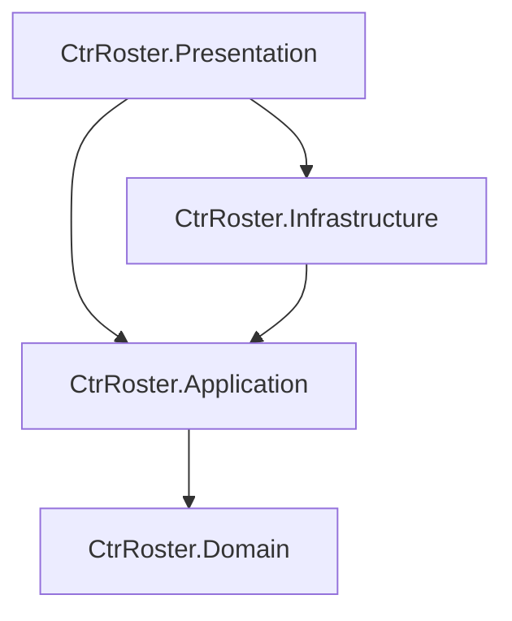

# Spécifications Techniques & Architecture — CTR-Roster

## 1. Vue d'Ensemble de l'Architecture

Le projet respecte les principes de la **Clean Architecture** stricte en 4 couches afin de découpler la logique métier de Discord et du moteur de base de données.

```
src/
├── CtrRoster.Domain/            # Entités pures, Invariants, Enums, Interfaces de persistance
├── CtrRoster.Application/       # Cas d'usage (Commands/Queries), Handlers, DTOs, Validations
├── CtrRoster.Infrastructure/    # EF Core SQLite (WAL), Scheduling, Renderer Discord concret
└── CtrRoster.Presentation/      # Bot Discord, InteractionRouter stateless, SlashCommands, Program.cs
```

### Dépendances entre projets

- **Règle absolue** : `CtrRoster.Domain` n'a **aucune dépendance** externe (pas de package NuGet Discord.Net ou EntityFrameworkCore).

---

## 2. Modèle de Données (Domaine & Persistence EF Core)

### Entités principales

```csharp
namespace CtrRoster.Domain.Enums;

public enum ParticipantRole
{
    Player,
    Spectator
}

public enum SessionStatus
{
    Open,
    Locked,
    Closed
}
```

```csharp
namespace CtrRoster.Domain.Entities;

public class GameSession
{
    public Guid Id { get; set; } = Guid.NewGuid();
    public DateTime CreatedAtUtc { get; set; } = DateTime.UtcNow;
    public DateTime ScheduledDate { get; set; }
    public ulong DiscordChannelId { get; set; }
    public ulong DiscordMessageId { get; set; }
    public SessionStatus Status { get; set; } = SessionStatus.Open;

    public List<PlayerAvailability> Availabilities { get; set; } = [];
    public List<GameTable> Tables { get; set; } = [];
}

public class GameTable
{
    public Guid Id { get; set; } = Guid.NewGuid();
    public Guid GameSessionId { get; set; }
    public GameSession GameSession { get; set; } = null!;

    public string GameName { get; set; } = string.Empty;
    public ulong CreatedByDiscordUserId { get; set; }
    public List<TableParticipant> Participants { get; set; } = [];
}

public class TableParticipant
{
    public Guid Id { get; set; } = Guid.NewGuid();
    public Guid GameTableId { get; set; }
    public GameTable GameTable { get; set; } = null!;

    public ulong DiscordUserId { get; set; }
    public string DiscordUsername { get; set; } = string.Empty;
    public ParticipantRole Role { get; set; } = ParticipantRole.Player;
}

public class PlayerAvailability
{
    public Guid Id { get; set; } = Guid.NewGuid();
    public Guid GameSessionId { get; set; }
    public GameSession GameSession { get; set; } = null!;

    public ulong DiscordUserId { get; set; }
    public string DiscordUsername { get; set; } = string.Empty;
    public bool IsAbsent { get; set; }
    public string PreferredGamesJson { get; set; } = "[]";
}

public class Game
{
    public Guid Id { get; set; } = Guid.NewGuid();
    public string Name { get; set; } = string.Empty;
    public int? MinPlayers { get; set; }
    public int? MaxPlayers { get; set; }
    public bool IsActive { get; set; } = true;
}
```

---

## 3. Persistance & Robustesse SQLite (WAL Mode)

Pour préserver la carte SD du Raspberry Pi et garantir la tolérance aux pannes :
1. **Mode WAL (Write-Ahead Logging)** :
   ```sql
   PRAGMA journal_mode = 'wal';
   PRAGMA synchronous = NORMAL;
   PRAGMA foreign_keys = ON;
   ```
2. **Cascade Deletes explicites dans EF Core** :
   - Suppression d'une `GameSession` $\rightarrow$ cascade sur `GameTable`, `PlayerAvailability`.
   - Suppression d'une `GameTable` $\rightarrow$ cascade sur `TableParticipant`.
   - Dissolution automatique : si le nombre de joueurs d'une table devient inférieur à 2, suppression de l'entité `GameTable` et sauvegarde.

---

## 4. Gestion des Conflits & Rate Limits Discord (HTTP 429)

### 4.1. Rate Limit Discord sur modification de message
Discord impose un plafond de **5 éditions par tranche de 5 secondes** sur un même message.
- **Solution** : Un service asynchrone d'actualisation (`DiscordUiThrottler`) s'appuyant sur un `System.Threading.Channels.Channel<Guid>`.
- Tout changement d'état (disponibilité, création de table, join, leave) pousse le `sessionId` dans le canal.
- Un worker d'arrière-plan dépile les demandes avec un **débouncing / throttle de 1 à 2 secondes**, garantissant un unique appel REST d'édition pour regrouper les clics concurrents.

### 4.2. Interactions Discord Stateless
Aucun gestionnaire d'événement éphémère en mémoire. En cas de redémarrage du bot, les boutons existants sur la Card continuent de fonctionner.
Format strict des `custom_id` :
```text
module:action:arg1:arg2...
Exemples:
- table:join:player:{tableId}
- table:leave:{tableId}
- table:delete:{tableId}
- session:avail:open
- session:absent:toggle
```
Le `InteractionRouter` découpe le `custom_id`, résout le Use Case scopé via `IServiceScopeFactory`, exécute l'action et répond par un message éphémère (`ephemeral: true`) pour l'utilisateur, tout en notifiant le `DiscordUiThrottler` pour rafraîchir la Card.
