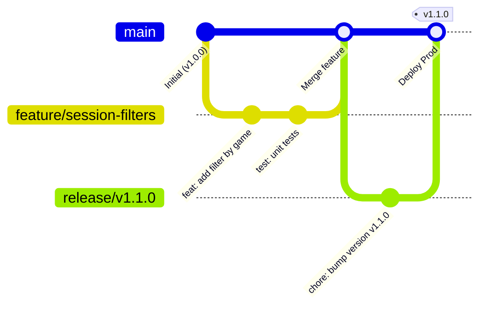

# Guide du Workflow Git & Gestion des Releases — CTR-Roster

Ce document définit les règles de collaboration Git pour le développement assisté par IA et la maintenance du projet **CTR-Roster**. Il garantit la stabilité de la branche principale (`main`), isole les développements et sécurise les mises en production sur Raspberry Pi.

---

## 1. Topologie des Branches



### Rôles des branches :
| Branche | Rôle | Règle d'or |
| :--- | :--- | :--- |
| `main` | Production & Stabilité | **Aucun dev direct.** Toujours compilable, tests 100% au vert, déployable immédiatement. |
| `feature/<nom>` | Nouvelle fonctionnalité | Branche éphémère créée depuis `main`. Supprimée une fois fusionnée. |
| `fix/<nom>` | Correction de bug | Branche éphémère pour investiguer et corriger un incident sans impacter `main`. |
| `release/vX.Y.Z` | Préparation de version | Stabilisation finale, changelog, validation build Docker avant tag et déploiement. |

---

## 2. Processus de Développement d'une Feature (avec l'IA)

À chaque fois qu'une nouvelle fonctionnalité ou une amélioration est demandée :

### Étape 1 : Partir d'une base propre
```bash
git checkout main
git pull origin main
git checkout -b feature/nom-de-la-feature
```

### Étape 2 : Développement & Validation
1. L'IA ou le développeur écrit le code et les tests unitaires associés dans `tests/CtrRoster.Domain.Tests`.
2. Vérification obligatoire de l'intégrité du projet :
   ```bash
   dotnet test
   ```
3. Commits atomiques respectant la convention **Conventional Commits** :
   - `feat: ...` : Nouvelle fonctionnalité visible pour l'utilisateur.
   - `fix: ...` : Correction d'un bug.
   - `test: ...` : Ajout ou correction de tests.
   - `refactor: ...` : Réorganisation du code sans changement de comportement.
   - `chore: ...` : Maintenance (dépendances, gitignore, docs).

### Étape 3 : Intégration dans `main`
Une fois le travail validé par les tests :
```bash
# 1. Revenir sur main et récupérer d'éventuels changements distants
git checkout main
git pull origin main

# 2. Fusionner la feature avec historique explicite (--no-ff)
git merge --no-ff feature/nom-de-la-feature -m "feat: merge feature/nom-de-la-feature into main"

# 3. Pousser sur GitHub
git push origin main

# 4. Supprimer la branche locale devenue obsolète
git branch -d feature/nom-de-la-feature
```

---

## 3. Processus de Release (Livraison Raspberry Pi)

Pour créer une nouvelle version officielle (ex: passage à `v1.1.0`) :

### Étape 1 : Branche de Release
```bash
git checkout main
git pull origin main
git checkout -b release/v1.1.0
```

### Étape 2 : Vérifications et Validation Finale
1. Lancer l'intégralité des tests :
   ```bash
   dotnet test
   ```
2. Tester le build Docker complet :
   ```bash
   docker compose build
   ```
3. Mettre à jour la documentation ou le numéro de version si nécessaire.
4. Valider le commit de release :
   ```bash
   git commit -am "chore: release v1.1.0"
   ```

### Étape 3 : Taguer et Fusionner dans `main`
```bash
git checkout main
git merge --no-ff release/v1.1.0 -m "release: v1.1.0"

# Création du tag Git annoté
git tag -a v1.1.0 -m "Version 1.1.0 : description des nouveautés"

# Pousser main et les tags sur GitHub
git push origin main --tags

# Nettoyage de la branche de release
git branch -d release/v1.1.0
```

---

## 4. Déploiement sur le Raspberry Pi

Sur le Raspberry Pi (`/opt/ctr-roster/`) :

```bash
# 1. Récupérer la dernière version ou le tag ciblé
git pull origin main

# Optionnel : pointer sur un tag spécifique
# git checkout v1.1.0

# 2. Reconstruire et relancer le conteneur sans interruption prolongée
docker compose up -d --build
```
