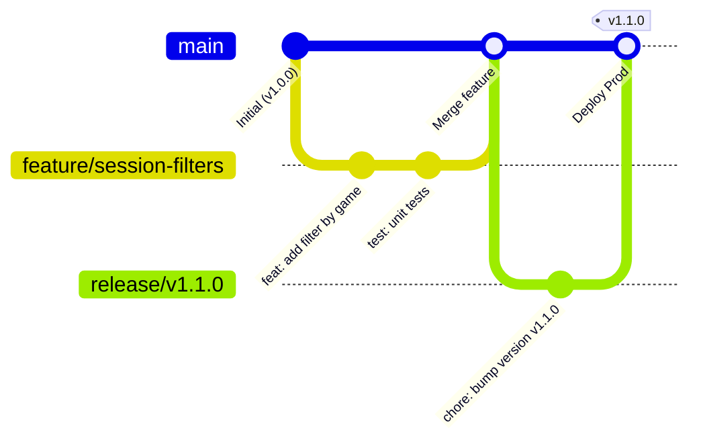

# Guide du Workflow Git & Gestion des Releases — CTR-Roster

Ce document définit les règles de collaboration Git pour le développement assisté par IA et la maintenance du projet **CTR-Roster**. Il garantit la stabilité de la branche principale (`main`), isole les développements et sécurise les mises en production sur Raspberry Pi.

---

## 1. Topologie des Branches



### Rôles des branches :
| Branche | Rôle | Règle d'or |
| :--- | :--- | :--- |
| `main` | Production & Stabilité | **Aucun dev direct.** Toujours compilable, tests 100% au vert, déployable immédiatement. |
| `feature/<nom>` | Nouvelle fonctionnalité | Branche éphémère créée depuis `main`. Supprimée une fois fusionnée. |
| `fix/<nom>` | Correction de bug | Branche éphémère pour investiguer et corriger un incident sans impacter `main`. |
| `release/vX.Y.Z` | Préparation de version | Stabilisation finale, changelog, validation build Docker avant tag et déploiement. |

---

## 2. Processus de Développement d'une Feature (avec l'IA)

À chaque fois qu'une nouvelle fonctionnalité ou une amélioration est demandée :

### Étape 1 : Partir d'une base propre
```bash
git checkout main
git pull origin main
git checkout -b feature/nom-de-la-feature
```

### Étape 2 : Développement & Validation
1. L'IA ou le développeur écrit le code et les tests unitaires associés dans `tests/CtrRoster.Domain.Tests`.
2. Vérification obligatoire de l'intégrité du projet :
   ```bash
   dotnet test
   ```
3. Commits atomiques respectant la convention **Conventional Commits** :
   - `feat: ...` : Nouvelle fonctionnalité visible pour l'utilisateur.
   - `fix: ...` : Correction d'un bug.
   - `test: ...` : Ajout ou correction de tests.
   - `refactor: ...` : Réorganisation du code sans changement de comportement.
   - `chore: ...` : Maintenance (dépendances, gitignore, docs).

### Étape 3 : Intégration dans `main`
Une fois le travail validé par les tests :
```bash
# 1. Revenir sur main et récupérer d'éventuels changements distants
git checkout main
git pull origin main

# 2. Fusionner la feature avec historique explicite (--no-ff)
git merge --no-ff feature/nom-de-la-feature -m "feat: merge feature/nom-de-la-feature into main"

# 3. Pousser sur GitHub
git push origin main

# 4. Supprimer la branche locale devenue obsolète
git branch -d feature/nom-de-la-feature
```

---

## 3. Stratégie de Versioning & Processus de Release

Le projet suit rigoureusement la convention [Semantic Versioning (SemVer)](https://semver.org/lang/fr/) adaptée aux besoins du projet :

```
Format de version : v[MAJEUR].[MINEUR].[PATCH][-BETA]
Exemples : v0.3.0-beta, v0.3.1-beta, v0.3.0, v1.0.0
```

### 3.1. Règles d'incrémentation

| Type | Format | Quand l'utiliser ? | Qui décide ? |
| :--- | :--- | :--- | :--- |
| **PATCH** | `0.X.Y` ➔ `0.X.Y+1` | Ajustements techniques, refactoring, corrections de bugs (fixes), optimisation de tests ou outillage. | Automatique (Développeur / IA) |
| **MINEURE** | `0.X.Y` ➔ `0.X+1.0` | Ajout d'une nouvelle fonctionnalité métier visible pour les utilisateurs. | À chaque nouvelle feature |
| **MAJEURE** | `X.Y.Z` ➔ `X+1.0.0` | Refonte majeure de l'application ou version de référence. | **Exclusivement le Product Owner (Utilisateur)** |

### 3.2. Règle de transition Beta ➔ Stable (Mineure non-beta)
- **Phase Beta (ex: `v0.3.0-beta`)** : Toute nouvelle version contenant des features est d'abord déployée en suffixe `-beta` sur le Raspberry Pi pour observation.
- **Promotion en Stable (ex: `v0.3.0`)** : La version est promue en version mineure stable officielle dès lors que :
  1. La version a tourné en production réelle sur le serveur Discord sans incident ni bug bloquant constaté.
  2. Le Product Owner donne son accord explicite pour le passage en version stable.

---

### 3.3. Règle d'or de Mise à Jour Documentaire
> ⚠️ **IMPACT DOCUMENTAIRE OBLIGATOIRE :**  
> À chaque nouvelle fonctionnalité, modification de commande ou ajustement d'interaction, le guide utilisateur ([`docs/GUIDE_UTILISATEUR.md`](GUIDE_UTILISATEUR.md)) **doit impérativement être mis à jour** dans la même branche de travail avant toute fusion dans `main`. Le code et sa documentation ne doivent jamais diverger.

---

### 3.4. Étapes d'une Release (Livraison Raspberry Pi)

Pour préparer et livrer une version officielle (ex: `v0.3.1-beta` ou `v0.4.0-beta`) :

#### Étape 1 : Branche de Release
```bash
git checkout main
git pull origin main
git checkout -b release/v0.3.1-beta
```

#### Étape 2 : Vérifications et Validation
1. Lancer l'intégralité des tests :
   ```bash
   dotnet test
   ```
2. Mettre à jour `Directory.Build.props` avec le nouveau numéro de version.
3. Renseigner les nouveautés dans `CHANGELOG.md`.
4. Valider le commit de release :
   ```bash
   git commit -am "chore(release): bump version to v0.3.1-beta"
   ```

#### Étape 3 : Taguer et Fusionner dans `main`
```bash
git checkout main
git merge --no-ff release/v0.3.1-beta -m "Merge release branch 'release/v0.3.1-beta' into main"

# Création du tag Git annoté
git tag -a v0.3.1-beta -m "Release v0.3.1-beta : description des changements"

# Pousser main et les tags sur le dépôt distant
git push origin main --tags

# Suppression de la branche de release locale
git branch -d release/v0.3.1-beta
```

---

## 4. Déploiement sur le Raspberry Pi

Sur le Raspberry Pi (`/opt/ctr-roster/`) :

```bash
# 1. Récupérer les derniers commits et tags
git fetch --tags

# 2. Pointer sur la version souhaitée
git checkout v0.3.1-beta

# 3. Compiler pour ARM/Linux
dotnet publish src/CtrRoster.Presentation/CtrRoster.Presentation.csproj -c Release -o ./publish

# 4. Redémarrer le service systemd
sudo systemctl restart ctr-roster

# 5. Vérifier les logs
journalctl -u ctr-roster -f
```
